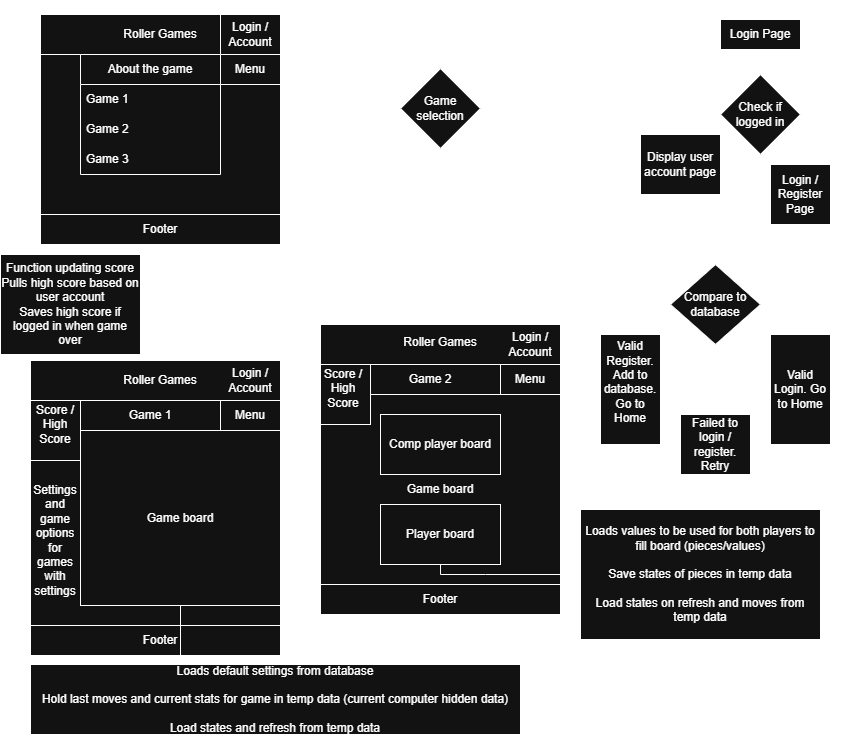

# Roller Games
Web prototype with multiple logic games

# Game Design Project

## Introduction
Because I want to work in game design, I’m planning to build a site focused on strategy games. The theme will likely be casino-inspired, featuring a variety of games that users can choose from.  

The site will include:
- User login system  
- Score tracking  
- Basic profile customization  

A database will be used to store assets, scores, and user login information.

---

## Content and Considerations
To attract and retain users, the site must be **fun, easy to navigate, and professional**.  

Some key considerations:
- Users won’t be forced to create an account, but customization options will be available as an incentive for logging in.  
- Since there are many online board and card game options, design and polish will be important to set this project apart.  
- Initial games will likely involve **cards or dice**:
  - Simple card games like **poker** or **blackjack**  
  - Possibly **solitaire**, if time allows  
  - Dice-based games like **Yahtzee**, which would allow exploration of different input types and web-based data handling  

---

## Conclusion
The first priority is building a **solid foundation and modular structure** to support future expansion.  

Next steps:
1. Define and document database requirements.  
2. Create a simple diagram outlining the site structure.  
3. Begin development of the initial core games.  

By focusing on flexibility and scalability early, I’ll be better positioned to add or refine features as the project evolves.

